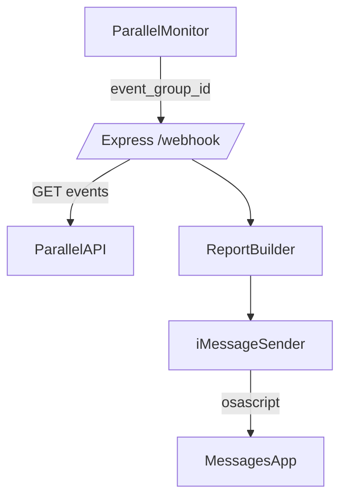

# Agents / Ops Notes

## Purpose
Continuous AI-news monitoring (OpenAI, Anthropic/Claude, Google Gemini, xAI Grok, Nvidia, broader AI/tech) using Parallel Monitor. Webhook events are aggregated and delivered via iMessage.

## Flow

## Components
- `src/server.ts`: Express server, dedupes `event_group_id`, fetches full events, builds report, sends iMessage.
- `src/report.ts`: Formats numbered summary + sources.
- `src/imessage.ts`: AppleScript sender via `osascript`; `DRY_RUN` to log only.
- `scripts/setupMonitor.ts`: Creates monitor (daily cadence, AI-news query) with configured webhook URL; stores `.monitor.json`.
- `scripts/fetchEvents.ts`: Fetch specific event group or recent events (10d lookback).
- `scripts/deleteMonitor.ts`: Delete monitor and clean `.monitor.json`.

## Environment
- `PARALLEL_API_KEY` (required)
- `WEBHOOK_URL` (required; public https when hosted)
- `IMESSAGE_RECIPIENT` (required unless dry-run)
- `DRY_RUN` (`true` to skip sending)
- `PORT` (default 3000)
- `NGROK_AUTHTOKEN` (optional, if tunneling)
- `MONITOR_ID` (optional override; otherwise `.monitor.json`)

## Local Test Commands
- Start server: `npm run dev`
- Health: `curl http://localhost:3000/health`
- Test notify: `curl -X POST http://localhost:3000/test/notify`
- Create monitor: `npm run setup:monitor`
- Fetch events: `npm run fetch:events -- <monitor_id> <event_group_id?>`
- Delete monitor: `npm run delete:monitor -- <monitor_id?>`

## Deployment (Mac mini)
1) Ensure Messages is signed in.
2) Run server persistently (pm2 or launchd).
3) Expose port via tunnel (ngrok/Cloudflare tunnel, etc.) and set `WEBHOOK_URL` to the public https URL + `/webhook`.
4) Re-run `npm run setup:monitor` so Parallel targets the new webhook URL.
5) Keep `DRY_RUN=false` for production; use `true` for safe tests.

## Safety / Privacy
- `.monitor.json` and `.env` are git-ignored; ensure they are not committed.
- Dry-run mode prevents accidental sends during testing.

